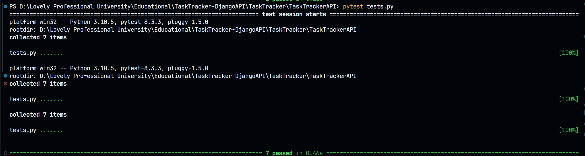

# TaskTracker

TaskTracker is a simple task management API built with Django.

## Features

- Create tasks
- List all tasks
- Get a specific task
- Update tasks
- Delete tasks
- Bulk add tasks
- Bulk delete tasks

## Requirements

- Python 3.7+
- pipenv

## Tech Stack
- Python
- Django (DRF)
- SQLite Database

## Installation

1. Clone the repository:
   ```sh
   git clone https://github.com/skp3214/TaskTracker.git
   cd TaskTracker
   ```

2. Install dependencies using pipenv:
   ```sh
   pipenv install
   ```

3. Activate the virtual environment:
   ```sh
   pipenv shell
   ```

4. Apply migrations:
   ```sh
   python manage.py migrate
   ```

## Running the Application

To run the application locally:

```sh
python manage.py runserver
```

The API will be available at `http://127.0.0.1:8000`.

## API Endpoints

- POST `/v1/tasks/create/`: Create a new task
- GET `/v1/tasks`: List all tasks
- GET `/v1/tasks/{task_id}`: Get a specific task
- PUT `/v1/tasks/{task_id}/update/`: Update a task
- DELETE `/v1/tasks/{task_id}/delete/`: Delete a task
- POST `/v1/tasks/bulk-add/`: Add multiple tasks
- DELETE `/v1/tasks/bulk-delete/`: Delete multiple tasks

## Running Tests

To run the tests:

```sh
cd TaskTrackerAPI
pytest tests.py
```

